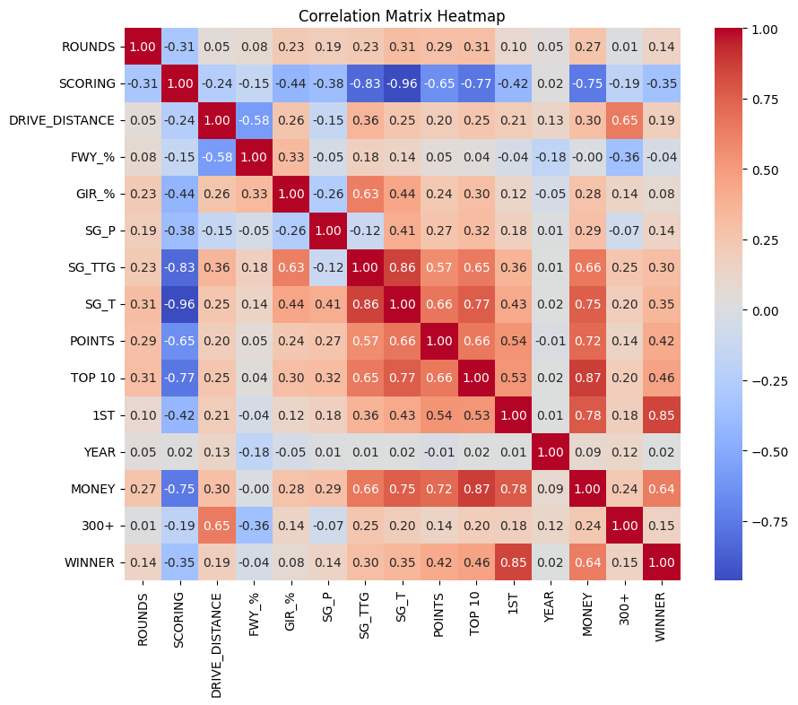

# Predicting PGA Tour Performance: An Analysis of Key Metrics from 2010-2017

## Project Description

This project leverages PGA Tour player data from 2010 to 2017 to unveil key performance metrics influential in golf outcomes and to employ machine learning models for predicting tournament winners. Utilizing a combination of Random Forest and Support Vector Machine (SVM) algorithms, this analysis focuses on the predictive power and importance of various golf performance metrics.

## Objectives

- **Feature Importance**: Identify and analyze the metrics that significantly impact the scoring average.
- **Predictive Modeling**: Evaluate and compare the effectiveness of Random Forest and SVM models in predicting tournament winners.

## Key Insights and Findings

- **Critical Metrics**: Key performance indicators include "Money", "Top 10 Finishes", and "Strokes Gained Total (SG_T)".
- **Model Comparison**: The SVM model demonstrated superior performance over the Random Forest model in predicting tournament winners with a maximum accuracy of 91%.
- **Feature Relevance**: Post-tournament features like "Money" and "Top 10 Finishes" proved highly influential but are not directly linked to in-game performance, suggesting the potential for more refined models that exclude such features to offer more accurate predictive insights.

### Correlation Insights

The heatmap below illustrates the correlations between various metrics and their impact on a player's likelihood to win a tournament. This visualization helps pinpoint which features are most strongly related to tournament success, guiding the feature selection process for model training.

## Technologies and Libraries Used

- **Programming Language**: Python
- **Libraries**: NumPy, pandas, Matplotlib, Seaborn, scikit-learn

## Model Performance

- The SVM model achieved a peak accuracy of 91%. This high accuracy underscores the model's ability to discern patterns and make predictions about tournament outcomes effectively.

## Conclusion

This study underscores the potential of advanced machine learning models like Random Forest and SVM in the realm of sports analytics, particularly in golf. It highlights the pivotal role of certain metrics in shaping tournament outcomes and calls for further investigation into models that focus solely on in-game performance metrics for deeper insights.

## Future Directions

Further research could explore excluding post-tournament features to focus on in-game performance metrics. Expanding the dataset and integrating more nuanced features could enhance the models' predictive accuracy and relevance to real-world strategies.
